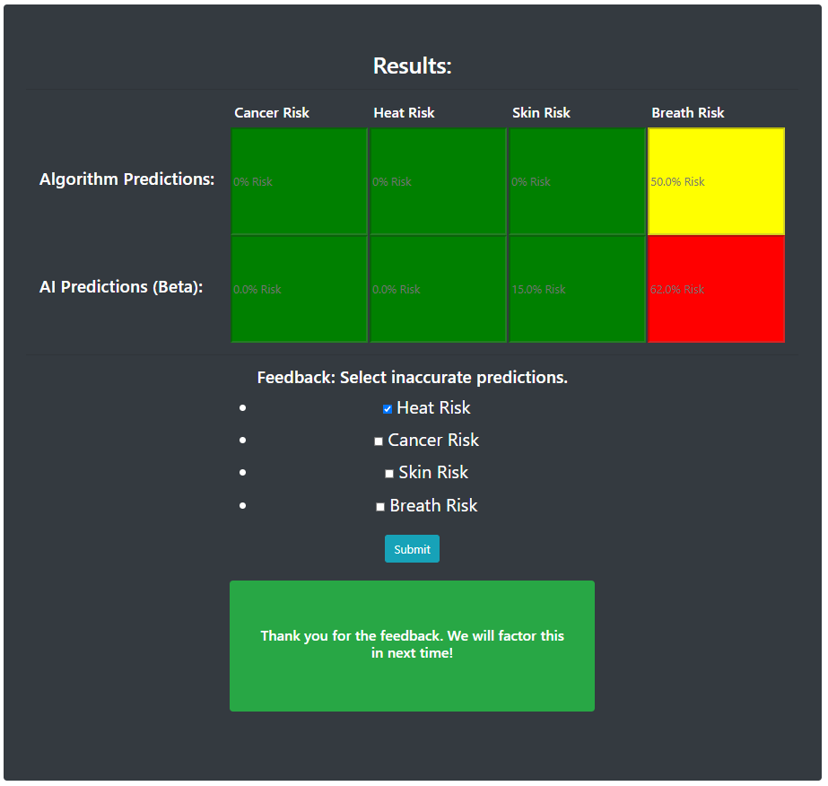

## What is WeatherOrNot?
WeatherOrNot is a health assistant that analyzes risks based on local climate using a machine learning and algorithmic hybrid system, assessing factors like UV index, pollen concentration, and more.

## Inspiration
It’s been known for years that poor neighborhoods experience much higher rates of chronic diseases, such asthma, diabetes, and more. Some of these conditions are adversely affected by climate patterns, like Air Quality Index and temperature. We decided to make a tool to assist these communities in this regard.
## What it does
Our web app provides a user friendly portfolio page, after they register and log in. The user then provides their location and health conditions, which will be stored into a database along with other information. They will then have access to up to date risk analysis, through email updates or directly on our app, based on their health conditions and climate data, with 3 different levels of warning. Finally, the user can provide feedback on whether the recommendation was correct, improving our systems performance.
## How I built it
Our app was built through the Django framework, which maintains the security of our product. We integrated a SQL database to keep track of patient information, including health conditions, over time. We also added an email server for more convenience. We use the Meteomatics and Weatherbit API’s to access climate data. Using all this data, our app runs a non-heuristic algorithm and a machine learning model (made from tensorflow and keras) to predict risk. The model can be improved through feedback from the user. Finally, we host our app on Google Cloud Platform.
## Accomplishments that I'm proud of
We are proud of integrating our SQL database, which makes access to location and health data more efficient. We are also proud of our model’s ability to improve over time from user feedback.
## What I learned
We learned a lot about how to use Django to make a web app. We researched the effects of weather on numerous chronic diseases. 
## What's next for WeatherOrNot
We will continuously train our machine learning model until it eventually replaces our algorithm. Currently, we only have about 20 diseases we can analyze; we plan to increase the size of this list.
